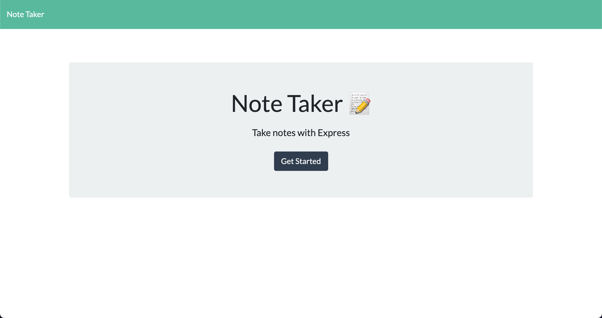
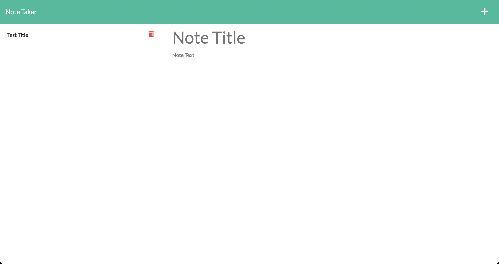
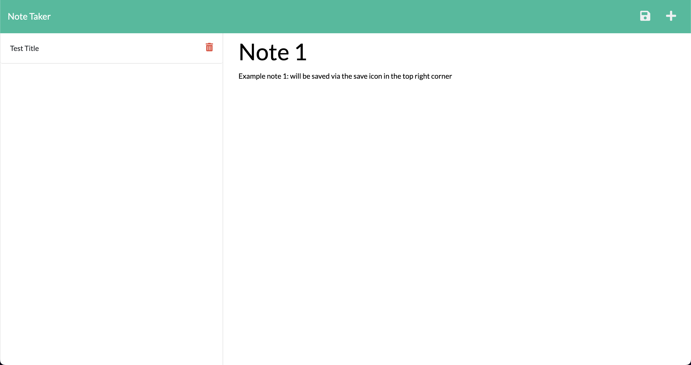
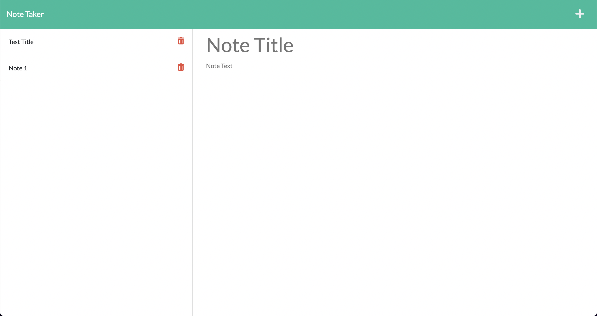
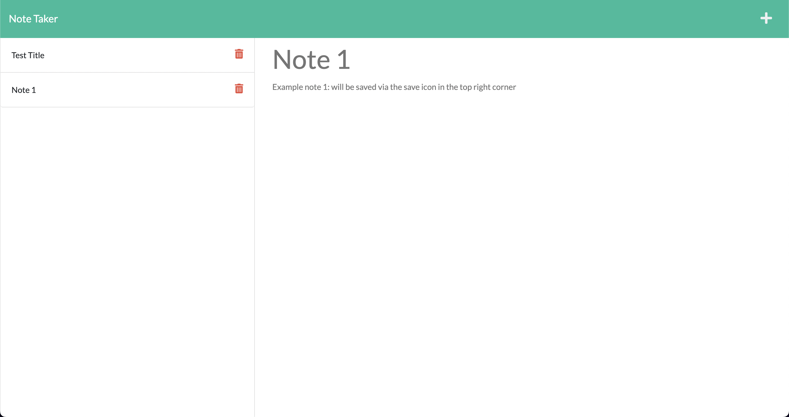
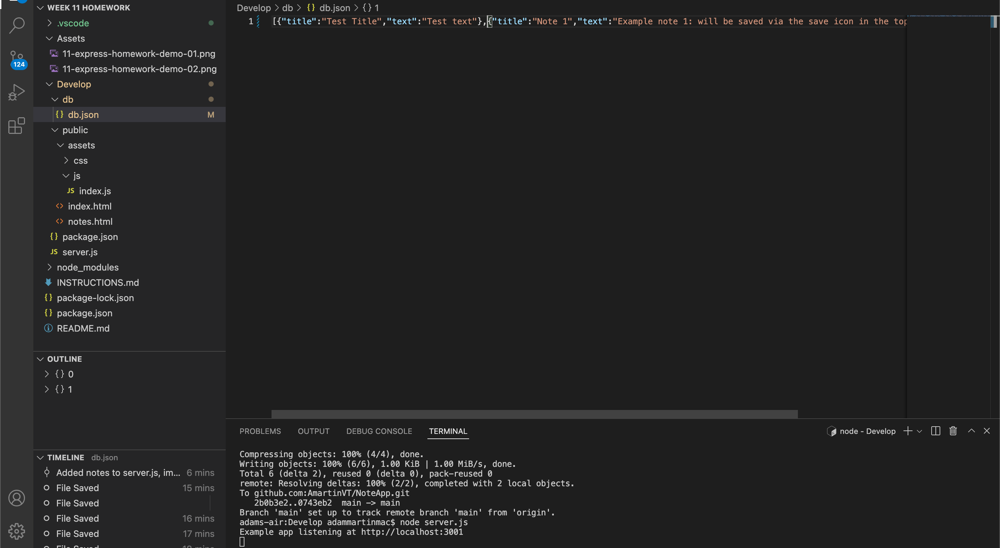

## Dev Info
Name: Adam Martin
Assignment: Note Taking App
Due Date: 7/24/22

## About this app
This app demonstrates local server usage via Express and Node. The user can create notes with titles and save them to the locally managed node database. The user can also clear the note using the "+" icon in the top right corner of the page and retrieve historical notes by clicking their title on the left side.

## Links
Git Repo: https://github.com/AmartinVT/NoteApp

Heroku Server: 

## Screenshots

## Dependencies
Express.js for framework between browser and local server
Node.js for local server management
fs for user entry
path for utility to manage local file directories
util for local server promises
